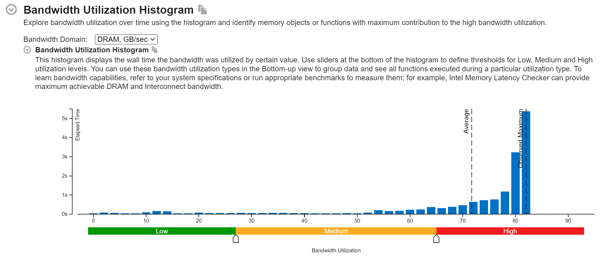
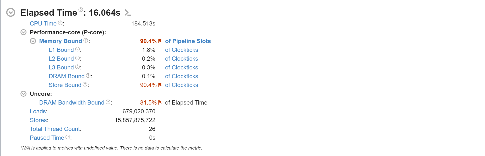

# Memory Bandwidth Saturation Test

## Overview

This C++ program is a memory bandwidth benchmark designed to measure the throughput of memory-intensive operations using multiple threads. It allocates a large buffer (1 GB by default) and uses threads to repeatedly write to it, saturating the memory bus. The program leverages AVX2 instructions (if available) for optimized performance on supported hardware and falls back to scalar operations otherwise. It outputs performance metrics, including throughput (in GB/s) and memory bandwidth utilization, presented in a formatted table.

The code addresses the problem of evaluating memory bus saturation and highlights the Von Neumann architecture's limitation, where a single shared memory bus can become a bottleneck for data-intensive tasks.

## Problem Statement

The program solves the following problem:

**Objective**: Use multiple threads to continuously read/write from a large buffer, saturating the memory bus, and collect throughput data (in GB/s).

**Context**: In the Von Neumann architecture, instructions and data share a single memory bus, creating a bottleneck when both are accessed frequently. This benchmark simulates a high-memory-load scenario to demonstrate how the memory bus can limit performance, especially as thread count increases and contention for the shared bus grows.

## Features

- **Multi-threaded**: Spawns threads equal to the number of logical CPU cores (`std::thread::hardware_concurrency()`).
- **AVX2 Optimization**: Uses 256-bit SIMD instructions for efficient memory writes on AVX2-capable CPUs.
- **Fallback Mode**: Scalar operations for non-AVX2 systems.
- **Performance Metrics**: Reports total time, data processed, throughput, and memory bandwidth utilization (assuming a 50 GB/s theoretical maximum).
- **Formatted Output**: Displays results in a clean, aligned table.

## Prerequisites

- **Compiler**: A C++11-compliant compiler (e.g., GCC, Clang, MSVC) with support for `<thread>` and `<atomic>`.
- **CMake**: Version 3.10 or higher for building the project.
- **Optional**: CPU with AVX2 support for optimized performance (e.g., Intel Haswell or later).
- **Operating System**: Tested on Linux; should work on Windows and macOS with minor adjustments.

## Build & Run

### Clone the Repository:

```bash
git clone https://github.com/username/bandwidth_saturation_test.git
cd bandwidth_saturation_test
```

Replace `https://github.com/username/memory-bandwidth-benchmark.git` with the actual repository URL.

### Create Build Directory:

```bash
cmake -S . -B build
```

- `-S .`: Source directory (current directory).
- `-B build`: Build directory.

### Build the Project:

```bash
cmake --build build --config Release
```

- `--config Release`: Builds with optimizations enabled.

### Run the Executable:

```bash
./build/bandwidth_test
```

On Windows, use `build\Release\bandwidth_test.exe`.

## Usage

After building, run the executable as shown above. No additional arguments are required.

## Example Output

**Optimized Results**:

```
+------------------------------------------------------------+
| Label                        |Value                        |
+------------------------------------------------------------+
| Number of threads            |22                           |
| Total time                   |5334 ms                      |
| Total data processed         |250.000 GB                   |
| Throughput                   |46.869 GB/s                  |
| Memory Bandwidth Utilization |93.738 % (assuming 50 GB/s)  |
+------------------------------------------------------------+
```

## Code Structure

### Key Components

- **Headers**:
  - `<iostream>`: For console output.
  - `<thread>`: For multi-threading.
  - `<vector>`: For the buffer.
  - `<chrono>`: For timing.
  - `<atomic>`: For thread-safe byte counting.
  - `<iomanip>`: For formatted output.
  - `<immintrin.h>`: For AVX2 intrinsics (conditional).

- **Constants**:
  - `BUFFER_SIZE`: 1 GB buffer (1ULL * 1024 * 1024 * 1024 bytes).
  - `NUM_THREADS`: Matches CPU core count.
  - `NUM_ITERATIONS`: 1000 iterations for sustained load.

- **Global Variables**:
  - `totalBytesProcessed`: Atomic counter for bytes processed across threads.
  - `buffer`: 1 GB vector of `int64_t`, aligned to 64 bytes for cache efficiency.

- **Functions**:
  - `threadWorker(int threadId, size_t chunkSize)`:
    - Processes a chunk of the buffer, writing a pattern (`0xDEADBEEFDEADBEEF` or `42`).
    - Uses AVX2 streaming stores (`_mm256_stream_si256`) or scalar writes.
    - Updates `totalBytesProcessed` atomically.
  - `main()`:
    - Spawns threads, measures time, calculates throughput, and prints results in a table.

## How It Works

- **Buffer Allocation**: A 1 GB buffer of `int64_t` is allocated and aligned to 64 bytes.
- **Threading**: The buffer is divided into chunks, one per thread, based on `NUM_THREADS`.
- **Writing**:
  - **AVX2 Path**: Uses 256-bit SIMD instructions to write 128 bytes per iteration, with prefetching (`_mm_prefetch`) to reduce latency.
  - **Fallback Path**: Writes scalar values (`42`) for non-AVX2 systems.
- **Measurement**: Each thread tracks bytes processed, aggregated via `std::atomic`. Total time is measured with `<chrono>`.
- **Output**: Throughput (GB/s) and utilization (% of 50 GB/s) are calculated and displayed in a 61-character-wide table.

## Von Neumann Bottleneck

The program demonstrates the Von Neumann limitation:

- **Shared Bus**: In the original architecture, a single bus handles both instructions and data. Modern CPUs mitigate this with caches and multi-channel memory, but the memory bus remains a bottleneck under heavy load.
- **Saturation**: By using multiple threads to write to a large buffer simultaneously, the program stresses the memory bus. As thread count increases, contention for the bus grows, potentially reducing throughput per thread.
- **Observation**: If throughput plateaus or drops despite more threads, it indicates the memory bus is saturated, reflecting the bottleneck.

## Limitations

- **Hardware Dependency**: Results vary by CPU (AVX2 support) and memory configuration (e.g., DDR4 vs. DDR5, single vs. dual-channel).
- **Theoretical Maximum**: Assumes 50 GB/s; adjust this based on your system’s specs for accurate utilization.
- **Simplified Workload**: Focuses on writes; real-world applications may involve mixed read/write patterns.


Certainly! Here's **only the "📈 Profiling Results"** section of your `README.md`, including the explanations and image placeholders:

---

## Profiling Results

The program was analyzed using **Intel VTune Profiler**, and the results confirm that it effectively **saturates the DRAM bandwidth**.

### 🔹 Bandwidth Utilization Histogram



* The histogram shows that the **majority of execution time is spent at or near the maximum observed DRAM bandwidth**.
* Utilization is concentrated in the **High** (red) region, indicating sustained memory pressure.
* The **observed maximum** reaches \~83 GB/s, while the **average** remains close, showing consistent high throughput across threads.

### 🔹 VTune Summary



| Metric                   | Value                   | Explanation                                                      |
| ------------------------ | ----------------------- | ---------------------------------------------------------------- |
| **Elapsed Time**         | 16.064 s                | Total measured runtime of the benchmark.                         |
| **Memory Bound**         | 90.4% of pipeline slots | CPU stalls mostly due to waiting on memory access.               |
| **DRAM Bound**           | 90.4%                   | Confirms the memory latency is not hidden by caching.            |
| **DRAM Bandwidth Bound** | 81.5% of elapsed time   | A significant portion of time spent waiting for DRAM throughput. |
| **Loads**                | \~679 million           | Number of memory read operations.                                |
| **Stores**               | \~15.8 billion          | Number of memory write operations (dominates due to AVX2).       |
| **Thread Count**         | 26                      | All logical CPU cores were utilized.                             |

These metrics validate that the program is **memory-bound** and successfully **saturates DRAM bandwidth**, replicating the conditions of a **Von Neumann bottleneck** scenario where throughput is limited not by computation but by memory access speed.

